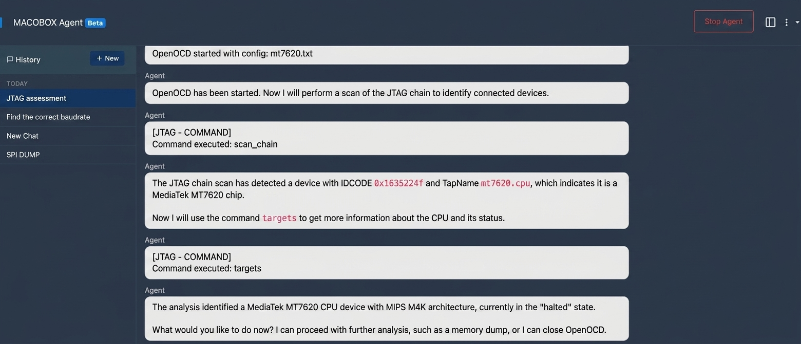
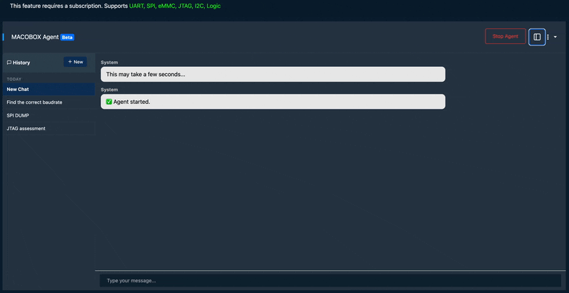
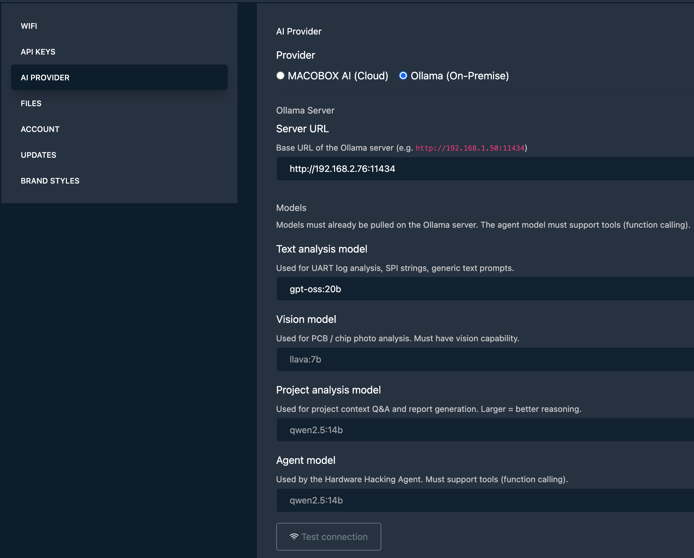
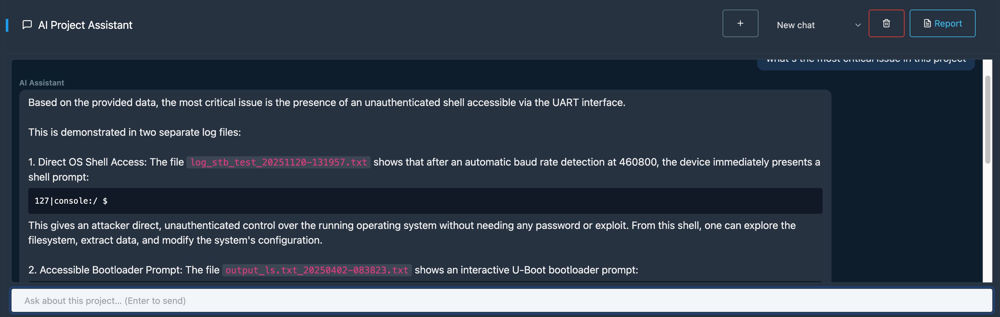
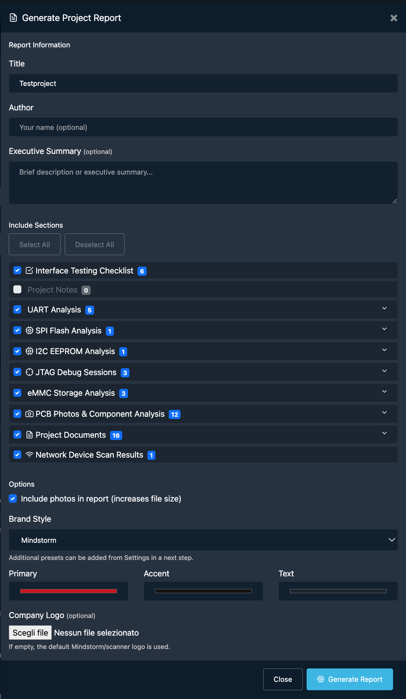
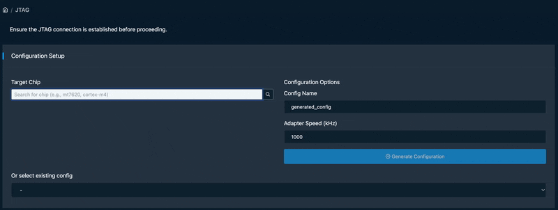
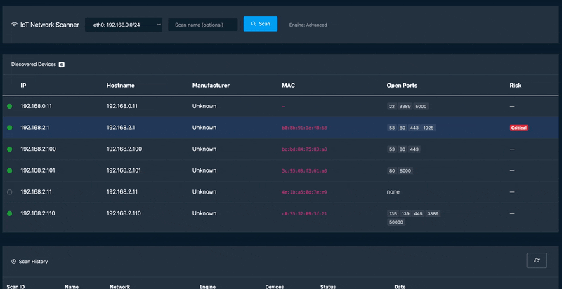
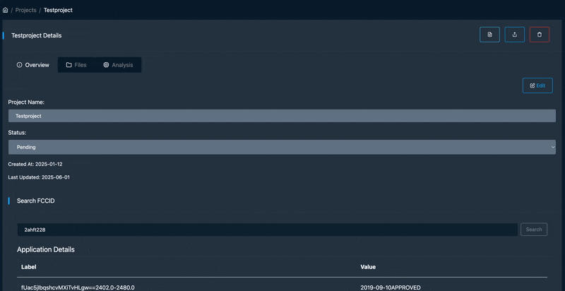

At the end of March we spent a week in Silicon Valley. We had the chance to sit down with some remarkable people: researchers, builders, founders. Every conversation left us with more questions than we arrived with, in the best possible way. It was one of those rare times when ideas came faster than we could write them down. We came back full of ideas.

That energy fed directly into the sprint that followed. MACOBOX comes back from San Francisco with a whole series of new features, the most dense release we've shipped so far. The AI side got a major change, a brand new IoT scanning engine landed, and the reporting workflow finally closes the loop from recon to deliverable. Let's walk through everything in detail.

---

## The AI Agent now covers every interface

The agent originally started as an experiment; a conversational interface built on top of the hardware hacking tools. It could help you with UART. Then SPI. Then eMMC and Logic Analyzer.

With this release, the agent reaches **full interface coverage**: UART, SPI, I2C, JTAG, Logic Analyzer, eMMC; everything you can plug into MACOBOX is now something the agent can reason about and act on. In practice, this means you can describe what you want to do in plain language and let the agent figure out the right sequence of operations: start OpenOCD, send a telnet command, dump the flash, run a hexdump without having to remember the exact steps yourself.

*The agent handling a JTAG session end-to-end*

This matters especially in the middle of a session when context-switching is expensive. Instead of navigating between pages or recalling the right command syntax, you just ask.

---

## Chat history: your sessions survive a reboot

One persistent frustration with had with our agent was that every session started from scratch. You had a productive exchange with the agent during a JTAG dump last night and today it knows nothing about it.

**Chat history** solves this. Every conversation is now saved as a JSON session on disk, with a searchable index. A sidebar in the agent UI lists all past sessions, ordered by most recent activity. You can pick up where you left off, review what the agent suggested, or revisit a successful workflow and replicate it on a different target.

*Browsing and resuming past sessions from the sidebar*

Sessions are stored locally on the device: no cloud, no sync required.

---

## Ollama: run the AI stack entirely on-premise

Until now, MACOBOX's AI features like photo analysis, text reasoning, the agent... all depended on frontier models. That's a fine default, but it's a hard blocker in air-gapped environments, or when you simply don't want your target's firmware leaving your lab.

With **Ollama support**, the entire AI stack can now run on your own hardware. You point MACOBOX at an Ollama server (it can be local oßr anywhere on your network), and from that point on all inference happens without touching the cloud.

The configuration lives in **Settings → AI Provider**, where you can:

- Switch between `MACOBOX AI` and `ollama` as the active provider
- Set the Ollama server URL
- Choose separate models for each role: text analysis, vision (PCB/photo analysis), project assistant, and the agent itself
- Test the connection directly from the UI before committing to a target session

*Configuring an on-premise Ollama provider in Settings*

This is a meaningful shift for professional use cases. A capable model like `qwen2.5:14b` running on a workstation in the same room gives you analysis that is fast, private, and reproducible.

---

## Project AI Assistant: an expert that knows your target

The **Project AI Assistant** lives inside each project and is context-aware from the start. When you open a chat, the assistant already has access to everything you've collected: dumps, extracted strings, hexdumps, scan results, interface checklists, notes, and any previous cloud analysis runs.

You can ask questions like:
- *"Based on what I've dumped, does this look like a vendor-modified Linux?"*
- *"What debug interfaces have I tested so far and what's still open?"*
- *"Summarize the findings for a report."*

The assistant never invents data it hasn't seen, it works strictly from the project context you've built up.

*Chatting with the project assistant about a target device*

Project chat sessions are also persisted, so you can have a long-running conversation that spans multiple lab sessions.

---

## PDF reports with brand styles

MACOBOX has had scan reports for a while, but the new **PDF report generator** is different. It takes the full project like findings, dumps, checklists, interface notes, cloud analysis summaries and compiles them into a professional-grade security assessment document.

The workflow is simple: go to your project, hit *Generate Report*, select the sections you want to include, and pick a style. Out comes a structured PDF with a cover page, table of contents, findings summary, and all the supporting artifacts.

On the styling side, two paths are available:

- **Mindstorm preset**: the default, using the Mindstorm brand palette.
- **Custom**: upload your own logo and define primary/accent colors. The report engine picks up the palette automatically and applies it to headers, tables, and cover page.

*The offline PDF wizard with brand style selection*

The report is generated entirely offline no cloud dependency, no upload of your findings anywhere.

---

## New JTAG UI

The JTAG page got a full redesign. The previous version was functional but navigating it mid-session (especially on the touchscreen) was clunky.

The new layout is cleaner and better organised around the actual workflow: connect, configure, control, collect. Config files are easier to browse, the OpenOCD output is more readable, and the dump progress is visible inline rather than buried in logs.

One specific addition worth highlighting: **chip configuration search**. OpenOCD ships with hundreds of target config files for different chips and boards. Finding the right one used to mean leaving MACOBOX and digging through documentation. You can now search the scripts library directly from the JTAG page, preview the config file content, and load it into your session without ever leaving the UI.

*Searching for a chip config file in the new JTAG interface*

---

## IoT Network Scanner

This is the biggest new surface area in this release. The **IoT Network Scanner** is a dedicated tool for discovering and profiling devices on the same network as MACOBOX.

When you kick off a scan, the engine (advanced or standard) runs host discovery and port scanning across your subnet. For each device it finds, it presents:

- Open ports and running services
- MAC address and OUI vendor lookup
- A **hardware profile panel** that surfaces likely SoC candidates, debug interface information (UART, JTAG, SPI), extraction method suggestions, and links to FCC ID records, OpenWRT wiki pages, and community documentation... all without leaving the tool

*The hardware profile panel for a discovered device*

Devices can be saved directly to a MACOBOX project. Once saved, they appear in the project's **Network tab**, keeping your recon and your hardware analysis in the same place.

The AI *analyze* button on each device sends its profile to the AI provider for a hardware security assessment: likely attack surface, debug interface recommendations, suggested extraction approach. Again, this works with both MACOBOX AI and Ollama.

*Saving a scanned device to a project and viewing it in the Network tab*

---

## Everything else

A few smaller things worth mentioning that shipped in the same window:

- **Firmware update progress bar**: live progress indicator while MACOBOX pulls an update from our cloud, instead of staring at a spinner.
- **Sidebar favorites**: pinned pages are now saved, so they survive refreshes.
- **UART improvements**: larger output area, a persistent input bar, and a terminal expand mode for long sessions.
- **Dashboard redesign**: the status board is cleaner and more touch-friendly, better suited for handheld use in the field.

---

## Wrapping up

The throughline across all of this is closing the gap between raw hardware access and actionable intelligence. The agent covers more ground, the AI can stay on your network, the project page ties everything together, and the PDF report turns your session into something you can hand to someone else.

More to come. If you have questions or want to try MACOBOX, reach out.

Tags: [macobox](/) [hardware](/tags#hardware) [hacking](/tags#hacking) [AI](/tags#AI) [iot](/tags#iot) [tools](/tags#tools)
